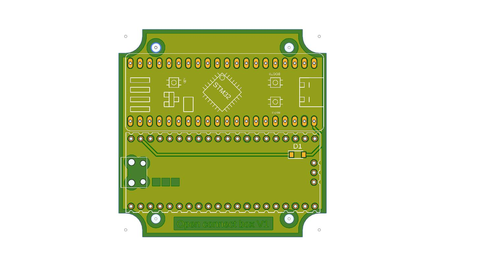

# Passerelle USB pour Chauffe-eau TFlow Aldes

Ce projet propose une passerelle USB permettant d'interfacer un chauffe-eau TFlow de la marque Aldes avec un système domotique basé sur le protocole MQTT. L'objectif est de permettre le contrôle à distance du chauffe-eau, la collecte de données et l'automatisation de certaines fonctions dans un environnement domotique.

# Hardware
  La partie hardware est composé de parties:

## la carte BLACKPILL (STM32)
  Elle permet de convertir les trames recues ou envoyées aux chauffe-eau et de les transferer via UART à la carte Raspberry pico W.

## la carte Raspberry pico W
  Elle gere la partie wifi, le protocole MQTT et le decodage des trames reçues par la carte STM32

## Schéma

  
## PCB

# Software

## la carte BLACKPILL (STM32F401)
  Elle est programmée en C, via l'IDE de chez ST microlectronics

## la carte Raspberry pico W
  Elle est programmée en micropython
  
# Avertissement

Ce projet n'a pas de but commercial et est fourni en l'état. L'auteur se dégage de toute responsabilité en cas de dommages directs ou indirects liés à l'utilisation de ce projet, y compris mais sans se limiter aux problèmes techniques, matériels, ou de sécurité qui pourraient survenir lors de l'utilisation de cette passerelle avec un chauffe-eau TFlow.

Il est fortement recommandé de toujours consulter les documents techniques officiels d'Aldes avant d'interagir avec le chauffe-eau, et d'effectuer des tests dans un environnement contrôlé.

# Contribuer

Les contributions à ce projet sont les bienvenues ! Si vous souhaitez contribuer, veuillez ouvrir une issue ou soumettre une pull request. Assurez-vous de respecter les bonnes pratiques de développement et de documentation.
